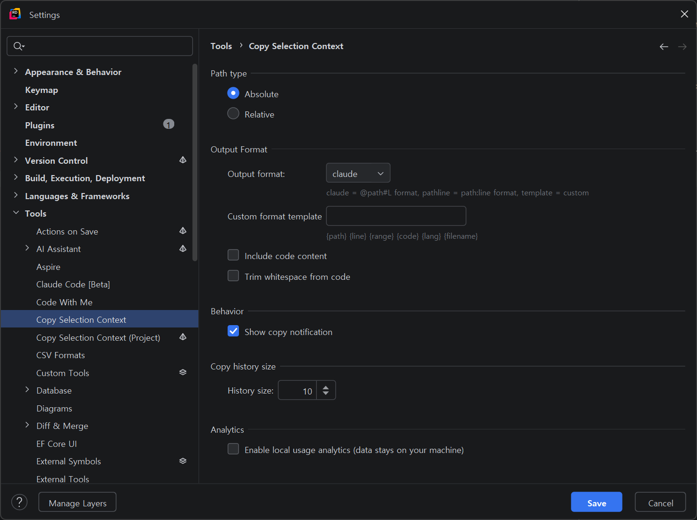

# Copy Selection Context

[](https://plugins.jetbrains.com/plugin/30262-copy-selection-context)
[](https://github.com/hon454/copy-selection-context/releases/latest)
[](https://github.com/hon454/copy-selection-context/releases)
[](https://github.com/hon454/copy-selection-context/graphs/contributors)
[](LICENSE)

**[English](README.md)** · **[한국어](README.ko.md)** · **[简体中文](README.zh-CN.md)** · **[繁體中文](README.zh-TW.md)** · **日本語**

> ファイルパス、行番号、コードを1つのショートカットでクリップボードにコピー。AIアシスタントへそのまま貼り付けられる形式です。

ClaudeやChatGPTなどのAIコーディングアシスタントにコードのコンテキストを共有するとき、ファイルパスや行番号を手入力していませんか？ **Copy Selection Context**なら、1つのショートカットで`@path#Lline`形式のコンテキストをクリップボードにコピーできます。

[](https://plugins.jetbrains.com/plugin/30262-copy-selection-context)

## 機能

- **ショートカットでコピー** — `Ctrl+Alt+C`でファイルパスと行番号をすぐにコピー
- **相対パスまたは絶対パス** — プロジェクト相対パスと絶対パスから選択可能
- **柔軟な出力形式** — Claude Code参照、Path:Line出力、カスタムテンプレートに対応
- **コード内容を含める** — 選択したコードをMarkdownコードブロックとして追加可能
- **コピー履歴** — `Ctrl+Alt+H`で最近のコピー履歴を表示
- **GitHub/GitLabパーマリンク** — 選択した行のGitパーマリンクをコピー
- **コピーのフィードバック** — コピーした行のマーク、任意の通知、ステータスバーへの最新コピー内容の保持
- **マルチcaretコンテキスト** — 各caretを個別にフォーマットし、パス/コードブロックを空行で区切る
- **正確な選択終了処理** — IntelliJの`selectionEnd - 1`を最後に含まれるoffsetとして扱い、余分な末尾行を除外
- **ローカライズされた設定** — 出力形式名を翻訳し、英語/韓国語リソースキーを一致させる
- **スマートな行番号処理** — テキストが選択されていない場合は現在の行番号をコピー
- **コンテキストメニュー** — エディターの右クリックメニューからすべてのアクションにアクセス
- **クロスプラットフォーム** — Windows、macOS、Linuxに対応

## インストール

### JetBrains Marketplaceから

1. `File` → `Settings` → `Plugins`
2. **「Copy Selection Context」**を検索
3. `Install`をクリック

### ディスクから

1. [Releases](https://github.com/hon454/copy-selection-context/releases)ページから最新の`.zip`をダウンロード
2. `File` → `Settings` → `Plugins` → ⚙️ → `Install Plugin from Disk...`
3. ダウンロードした`.zip`を選択 → IDEを再起動

## 使い方

### キーボードショートカット

| アクション | Windows/Linux | macOS |
|------------|---------------|-------|
| Copy Selection Context | `Ctrl+Alt+C` | `Cmd+Alt+C` |
| Show Copy History | `Ctrl+Alt+H` | `Ctrl+Alt+H` |

> ショートカットは`Settings` → `Keymap`で変更できます。

### コンテキストメニュー

エディター内で右クリック → **Copy Selection Context**サブメニュー：

| アクション | 説明 |
|------------|------|
| Copy Selection Context | 設定に基づいてパスと行番号をコピー（メインアクション） |
| Copy Relative Path with Line Numbers | プロジェクト相対パスでコピー |
| Copy Absolute Path with Line Numbers | 絶対パスでコピー |
| Copy with Code Content | パス、行番号、コードブロックをコピー |
| Copy GitHub/GitLab Permalink | Gitリモートリポジトリのパーマリンクをコピー |
| Show Copy History | 最近のコピー履歴ポップアップを表示 |

### 出力形式

メインアクションと個別のパス/コードアクションは、設定で選択した出力形式を使用します。パス区切り文字はスラッシュに統一されます。

各caretは独自の1始まりの包含範囲と任意のコードブロックを生成し、ブロック間は空行で区切られます。IntelliJの選択終了位置はexclusiveなので、`selectionEnd - 1`が最後に含まれる行を決めます。次の行の先頭で終わる選択にはその行を含めません。

**Claude Code (`claude`、デフォルト)**：
- 1行：` @src/main/kotlin/App.kt#L42 `
- 複数行：` @src/main/kotlin/App.kt#L250-253 `

**Path:Line (`pathline`)**：
- 1行：`src/main/kotlin/App.kt:42`
- 複数行：`src/main/kotlin/App.kt:250-253`

**カスタムテンプレート (`template`)**：
- Path and Range、Claude Reference、With Code Blockプリセットから開始するか、独自のテンプレートを入力
- 標準コピーアクションが設定する変数：`{path}`、`{line}`、`{range}`、`{code}`、`{lang}`、`{filename}`
- 設定画面で結果をプレビューし、不明な変数を検出

**コード内容を含める**（Claude CodeとPath:Lineはコードブロックを追加し、カスタムテンプレートは`{code}`で配置）：
````
 @src/main/kotlin/App.kt#L42-53
```kotlin
fun calculateTotal(items: List<Item>): Double {
    return items.sumOf { it.price }
}
```
````

個別の **Copy GitHub/GitLab Permalink** アクションは、バックグラウンドスレッドで通常のリポジトリまたはlinked worktreeのメタデータを読み、各caretにコミット固定のURLを生成します。最新のリクエストだけがクリップボードを更新できます。リモートまたはコミットを解決できない場合はエラーを通知し、クリップボードを変更しません。

### 履歴、通知、ステータス

- 標準のパス/コードコピーアクションは、プロジェクト別履歴の先頭に項目を追加します。`Ctrl+Alt+H`で保存済みの項目を開き、選択すると完全な内容を再度コピーします。
- コピー通知はデフォルトで有効ですが、無効にできます。標準のパス/コードコピーとGitパーマリンクコピーの後に表示されます。
- 標準コピーはアクティブエディターのガターマーカーを置き換え、ステータスバーウィジェットに接頭辞を含めて最大40文字の単一行・Unicode-safe・markup-escapedプレビューを表示します。ウィジェットをクリックすると最後の完全な値を再度コピーします。
- 任意のローカル使用状況分析は、IDEのアプリケーション設定にコピー回数と出力形式の使用量を記録します。デフォルトでは無効で、データを端末外へ送信しません。

### 設定

`Settings` → `Tools` → `Copy Selection Context`：

- **Path type** — Absolute（デフォルト）またはRelative
- **Output format** — Claude Code（デフォルト）、Path:Line、Custom Template
- **Custom format template** — プリセットを選択するか、アクセシビリティラベルと変数検証を備えた6行の複数行エディター、およびフォーカス可能な6行のライブプレビューを使用
- **Include code content** — 選択したコード、または未選択時の現在行を含める（デフォルト：オフ）
- **Trim code whitespace** — 含めたコードの先頭と末尾の空白を削除（デフォルト：オフ）
- **Show copy notifications** — 対応するコピーアクション後にバルーン通知を表示（デフォルト：オン）
- **Copy history size** — プロジェクトごとに0～100件を保持（デフォルト：10）。`0`で履歴を無効化して削除
- **Local usage analytics** — オプトインのコピーカウンターをこの端末だけに保存（デフォルト：オフ）

コピー履歴にはコピーしたコードが含まれる場合があります。データはIDEのローカルな非ローミングワークスペースにのみ保存され、共有可能なプロジェクト設定には書き込まれません。履歴ポップアップ下部の **Clear all history** ですべての項目を削除できます。最大件数を減らすと古い項目はすぐに削除され、以前 `copySelectionHistory.xml` に保存された履歴はローカルワークスペースストレージへ移行された後、IDEによって旧ファイルが削除されます。

#### 設定画面



パスの種類、出力とテンプレート、コード処理、通知、履歴、ローカル分析を1つの画面で設定できます。

## 対応IDE

IntelliJ Platform 2024.3以降をベースとするすべてのIDEで動作します：

IntelliJ IDEA · Android Studio · PyCharm · WebStorm · PhpStorm · CLion · GoLand · Rider · RubyMine

## 開発

```bash
git clone https://github.com/hon454/copy-selection-context.git
cd copy-selection-context

# Unix / macOS
./gradlew buildPlugin    # Build plugin ZIP
./gradlew runIde         # Run dev IDE with plugin
./gradlew test           # Run tests

# Windows
gradlew.bat buildPlugin
gradlew.bat runIde
gradlew.bat test
```

開発とリリースの詳しいガイドについては、[CONTRIBUTING.md](CONTRIBUTING.md)をご覧ください。

テストスイートには、実際のIntelliJエディター/アクション/クリップボードと非同期パーマリンクフローを検証する`CopySelectionActionFixtureTest`が含まれます。CIは成果物を公開する前に、全テスト、プロジェクトと構造のチェック、`verifyPlugin`互換性検証、プラグインのパッケージ化、ZIPチェック、診断アップロードを実行します。

## サポート

このプラグインが役に立ったら、ぜひコーヒーをごちそうしてください！

<a href="https://www.buymeacoffee.com/hon454s" target="_blank"></a>

## ライセンス

Apache License 2.0 — 詳細は[LICENSE](LICENSE)をご覧ください。

## 作者

[@hon454](https://github.com/hon454)が開発
