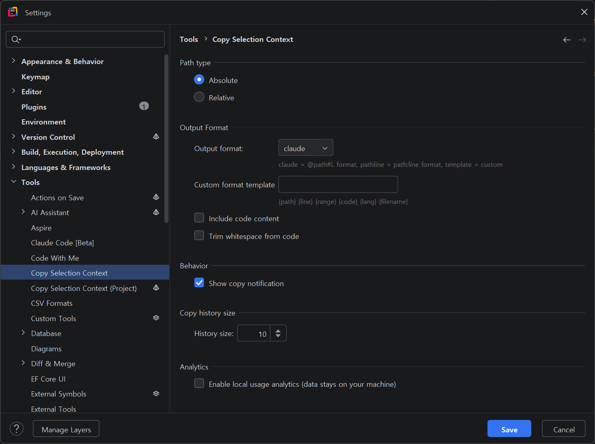

# Copy Selection Context

[](https://github.com/hon454/copy-selection-context/actions/workflows/build.yml)
[](https://plugins.jetbrains.com/plugin/com.github.hon454.copy-selection-context)
[](https://plugins.jetbrains.com/plugin/com.github.hon454.copy-selection-context)
[](LICENSE)

**[English](README.md)**

> 파일 경로 + 라인 번호 + 코드를 한 번의 단축키로 클립보드에 복사 — AI 어시스턴트에 바로 붙여넣기 가능한 형식으로.

AI 코딩 어시스턴트(Claude, ChatGPT 등)에게 코드 컨텍스트를 전달할 때, 파일 경로와 라인 번호를 일일이 타이핑하고 계신가요? **Copy Selection Context**는 한 번의 단축키로 `@path#Lline` 형식의 컨텍스트를 클립보드에 복사합니다.

## 기능

- **원클릭 복사** — `Ctrl+Alt+C` 하나로 파일 경로 + 라인 번호 복사
- **상대/절대 경로** — 프로젝트 상대 경로 또는 절대 경로 선택
- **코드 내용 포함** — 마크다운 코드 블록으로 선택한 코드까지 포함 가능
- **복사 이력** — `Ctrl+Alt+H`로 최근 복사 이력 조회
- **GitHub/GitLab 퍼머링크** — 선택한 라인의 Git 퍼머링크를 바로 복사
- **스마트 라인 처리** — 선택 없이 커서만 있으면 현재 줄 번호를 복사
- **컨텍스트 메뉴** — 에디터 우클릭 메뉴에서 모든 액션 접근
- **크로스 플랫폼** — Windows, macOS, Linux 모두 지원

## 설치

### JetBrains Marketplace에서 설치

1. `File` → `Settings` → `Plugins`
2. **"Copy Selection Context"** 검색
3. `Install` 클릭

### 파일에서 직접 설치

1. [Releases](https://github.com/hon454/copy-selection-context/releases) 페이지에서 최신 `.zip` 다운로드
2. `File` → `Settings` → `Plugins` → ⚙️ → `Install Plugin from Disk...`
3. 다운로드한 `.zip` 선택 → IDE 재시작

## 사용법

### 단축키

| 액션 | Windows/Linux | macOS |
|------|---------------|-------|
| Copy Selection Context | `Ctrl+Alt+C` | `Cmd+Alt+C` |
| 복사 이력 보기 | `Ctrl+Alt+H` | `Ctrl+Alt+H` |

> 단축키는 `Settings` → `Keymap`에서 변경할 수 있습니다.

### 컨텍스트 메뉴

에디터에서 우클릭 → **Copy Selection Context** 서브메뉴에서 개별 액션 선택:

| 액션 | 설명 |
|------|------|
| Copy Selection Context | 설정에 따라 경로 + 라인 복사 (메인 액션) |
| Copy Relative Path with Line Numbers | 프로젝트 상대 경로로 복사 |
| Copy Absolute Path with Line Numbers | 절대 경로로 복사 |
| Copy with Code Content | 경로 + 라인 + 코드 블록 복사 |
| Copy GitHub/GitLab Permalink | Git 원격 저장소 퍼머링크 복사 |
| Show Copy History | 최근 복사 이력 팝업 |

### 출력 형식

`@path#Lline` 형식으로 AI 어시스턴트에 바로 붙여넣기 가능합니다.

**경로만 (기본)**:
- 단일 라인: `@src/main/kotlin/App.kt#L42`
- 여러 라인: `@src/main/kotlin/App.kt#L250-253`

**코드 포함 (설정에서 활성화)**:
````
@src/main/kotlin/App.kt#L42-53
```kotlin
fun calculateTotal(items: List<Item>): Double {
    return items.sumOf { it.price }
}
```
````

### 설정

`Settings` → `Tools` → `Copy Selection Context`에서 설정:

- **Path type** — Absolute (기본) 또는 Relative
- **Include code content** — 코드 블록 포함 여부

#### 설정 화면



하나의 화면에서 경로 타입, 출력 형식, 코드 포함 여부, 알림 동작, 이력 옵션을 함께 조정할 수 있습니다.

## 호환 IDE

IntelliJ Platform 2024.3+ 기반 모든 IDE에서 동작합니다:

IntelliJ IDEA · Android Studio · PyCharm · WebStorm · PhpStorm · CLion · GoLand · Rider · RubyMine

## 개발

```bash
git clone https://github.com/hon454/copy-selection-context.git
cd copy-selection-context

./gradlew buildPlugin    # 플러그인 ZIP 빌드
./gradlew runIde         # 플러그인이 설치된 개발용 IDE 실행
./gradlew test           # 테스트 실행
```

자세한 개발 및 배포 가이드는 [CONTRIBUTING.md](CONTRIBUTING.md)를 참고하세요.

## 후원

이 플러그인이 유용하셨다면 커피 한 잔 사주세요!

<a href="https://www.buymeacoffee.com/hon454s" target="_blank"></a>

## 라이선스

Apache License 2.0 — 자세한 내용은 [LICENSE](LICENSE)를 참고하세요.

## 만든 사람

[@hon454](https://github.com/hon454)
