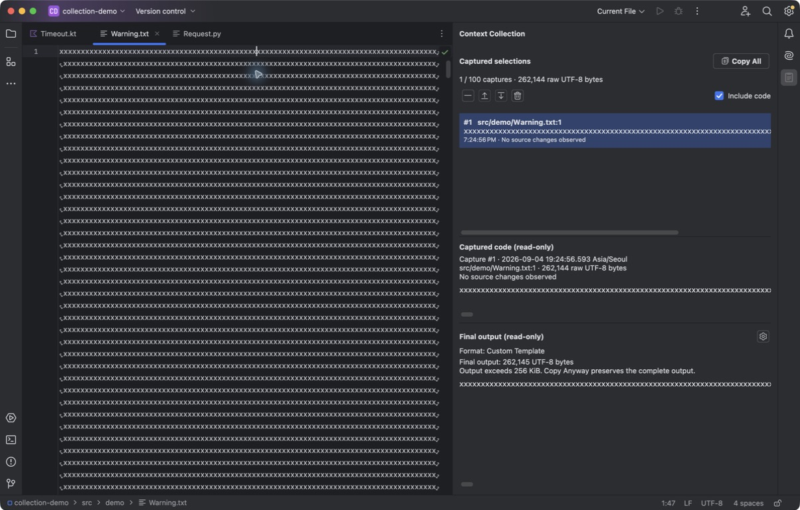

# Context Collection actual IDE capture guide

The screenshots below are real English IDE captures for #74 and the #93 UI refinement. They are repository assets, not evidence of Marketplace publication. The local development version remains 1.4.1.

## Environment and provenance

- Captured source SHA: `4de4caf6e097d5a54a5ec52e62b4d26c935d5a9d`.
- Installed validation ZIP SHA256: `2c6c8efacc5c4275669433a0bfda2ca71f820470069c8bed5901d978c70893e1`. This is not a canonical release ZIP.
- IDE: official IntelliJ IDEA Community 2024.3, IC-243.21565.193; JBR 21.0.5+8-b631.16; macOS 26.6.2 aarch64.
- The official native distribution was signature-verified by the coordinator. Its binary and signature were not modified. Dedicated config/system/plugins/log directories live under the implementation worktree's `build/ide-runtime/`, selected through external `IDEA_PROPERTIES`.
- Final UI language/theme: English, default Dark. Native short capture times use the IDE locale. Full metadata includes milliseconds and Asia/Seoul; shared output snapshot labels use UTC.
- Actual main-window frame: 1456×929 logical pixels; CUA exports 1204×768 JPEG. Both overview and preview use that same frame and export size. Earlier 1229×768 images are superseded.
- **Required export variation:** macOS presents the confirmation as a separate native window. The supported CUA App screenshot API captures that window alone, producing 370×179 JPEG. It has no whole-screen or parent-window-plus-modal selector. The third required PNG therefore preserves the actual confirmation at 370×179. It is not replaced by an inline warning. The optional inline warning uses the common 1204×768 frame.
- Original JPEG and accessibility text are preserved under `build/evidence/context74/`. PNG conversion uses only `sips -s format png original.jpg --out final.png`; no resizing, cropping, compositing, retouching or generated UI was used.

| Asset | Original capture | PNG pixels | SHA256 |
| --- | --- | --- | --- |
| `context-collection-overview.png` | `final-overview.jpg` | 1204×768 | `e66f8a435b852b5436d27548dc552e89c4b6ddb4c581f2cfb5701b21d182e26f` |
| `context-collection-preview.png` | `final-preview.jpg` | 1204×768 | `1404fad59d73ba4566f2ce419d26ca57b06061c0602d169dc1a55495cab06010` |
| `context-collection-size-warning.png` | `final-size-warning-dialog.jpg` | 370×179 | `075872d521a0aee84fda118af6acb96a5a728b4fe86e5a342f98ff7d8572a4b3` |
| `context-collection-size-warning-inline.png` (supplemental) | `final-size-warning-inline.jpg` | 1204×768 | `efcf76dd2a9a4e041e448dd0ceff4e9b58af6f6f81f73d4a2efae4b6b9d19d7e` |

The final overview's capture #1 is 2026-09-04 19:16:17.946 Asia/Seoul; #2 is 19:16:28.818 and #3 is 19:16:46.380. The preview adds #4 at 19:17:22.092. These follow the final ZIP installation and native process launch recorded in `/private/tmp/csc74-ide-final.log`. The warning was captured in another session of the same installed ZIP at 19:24:56.593, after CUA recovery described below. Capture times were never edited.

## Reproduction

Copy the committed non-sensitive samples in `docs/samples/context-collection/` into an isolated project under `src/demo/`. Reset Timeout.kt to 10 before the session. In Format Settings choose Relative paths and Path:Line, disable copy notifications, and keep collection Include code enabled. Use the dedicated QA IDE, not another user IDE session.

1. Capture exactly `val timeout = 10` on line 3 (#1), `val retries = 3` on line 4 (#2), and Request.py lines 1–2 without the final newline (#3). These contain 16, 15 and 36 raw bytes: three captures, 67 raw UTF-8 bytes, 177 Path:Line output bytes in this IC build (`py` language tag).
2. Open the collection, select #1, hide the Project tool window, and keep the two source tabs visible. The overview shows the Python editor, ordered captures, separate raw/output counts, and original Kotlin code. Dismiss ordinary IDE suggestion banners through their real controls.
3. Edit line 3 to `val timeout = 30`, select the same range and add #4. The earlier snapshot stays 10. Move #4 up twice, producing #1, #4, #2, #3. Select #1. Four captures contain 83 raw bytes and 315 output bytes. The preview shows the editor's 30, captured original 10, and both labeled output blocks.
4. Run `python3 docs/samples/context-collection/generate-warning.py build/ide-demo/warning-demo`. Copy its `src/demo/Warning.txt` into the disposable capture project's `src/demo/`, keeping the same window frame. Clear the small captures with explicit confirmation. Choose Custom Template and enter `{code}` followed by exactly one newline. Open Warning.txt through File → Open or Recent Files, select all, and add it once. The collection has one 262144-byte raw capture and 262145 output bytes. Do not capture expected-warning-output.txt.
5. Capture the optional inline warning, invoke Copy All, and capture the actual native confirmation. It shows 262145 UTF-8 bytes, one item, the above-256-KiB warning and Cancel/Copy Anyway. Default Enter cancels. The confirmation-only export variation is intentional and documented above.

Do not infer clipboard bytes from a saved editor file: the IDE may normalize trailing whitespace on save. Verify the unsaved paste and selected character count, as done below.

## Executed UI checks

The final adapter change only removes generated factory bridges; independent bytecode review confirmed the content-creation body is unchanged. Earlier layout/theme checks used `3b0a7faf0dc14619dcfe456c938d8b0e10699ae6`, whose panel/viewer implementation is identical to the final captured source.

| Check | Observed result and evidence |
| --- | --- |
| Capture and stable selection | Capturing keeps the editor selection/focus. Existing selection survives further captures. Final overview/preview AX records the immutable values, numbers, times and exact counts. |
| Keyboard organization | Arrow keys select; Move Up twice keeps #4 selected and changes output order. At 3b0a7fa, Delete in a viewer retained the capture; Delete in the list removed the last capture and focused Include code. |
| Source changes | Editing 10→30 marks earlier source state changed while original code remains 10. New #4 has its own time and output label. |
| Include code | At 3b0a7fa, 67 raw bytes stayed constant while final output changed 177→69→177; one-shot code inclusion stayed independent. |
| Clear | Default Enter canceled and retained one capture. Explicit Clear All removed all four small captures; Copy All disabled and Include code received focus. |
| Hide and no-editor state | Hide/reopen at 3b0a7fa retained four items, selection and 315-byte output. Closing all three editors at 4de4caf left the collection and Copy All available. Earlier no-editor opening was also exercised; the platform fixture checks action availability without an editor. |
| Plain-text viewers | Full long metadata and the 216-byte prepared output copied through normal text selection at 3b0a7fa. Deleting in the read-only viewer did not remove the capture. `final-viewer-copy-ja-ax.txt` preserves the unsaved pasted output. |
| Narrow and localized layout | Actual Japanese IDE, six repetitions of `LongProjectComponentName` plus `.kt`, one 43-byte capture/216-byte output. Full metadata scrolls while both code viewports remain accessible. `final-long-path-narrow-ja.jpg` and AX; English narrow populated evidence is `final-populated-narrow-dark.jpg`. |
| Light/Dark | Actual theme switching kept controls and content readable; `final-populated-light.jpg` and final Dark images. Japanese was restored to English before final captures. |
| Warning Cancel | Copy one `x` normally, invoke Copy All and press Enter. Replacing the disposable editor contents by paste produced exactly `x`; the collection remained one item. `final-warning-cancel-ax.txt`. |
| Warning Copy Anyway | Restore the sample, invoke Copy All and explicitly choose Copy Anyway. Unsaved paste/select-all reported `262145 chars, 1 line break`; the collection remained one item/262144 raw bytes. `final-warning-copy-anyway-ax.txt`. No truncation occurred. |
| Disposal | Actual QA IDE exited normally. Platform fixtures separately check content disposal, stale output, changed-revision clear rejection, and detached viewer lifecycle. |

CUA occasionally returned only a window title and no screenshot after the output-format combo popup. Rebinding alone did not recover it. Normal IDE exit/restart restored observation. The format was selected by its observed keyboard order, the template entered, then saved; its actual value and exact 262145-byte result were verified after restart. This is a capture-tool recovery, not a product failure or a substitute for verification.

## UI/UX refinement and verification

Before images (`layout-before.jpg`, `preview-design-baseline.jpg`) show the initial equally weighted button grid and heavy dividers. Final #93 changes use a primary Copy All action, compact accessible management icons, path-first rows, native spacing and one-pixel dividers. Counts sit with the content they measure. Capacity remains available in the summary tooltip/accessibility description. Active metadata uses normal foreground. Bounded selectable metadata/warning scroll panes preserve usable code viewports for long paths.

Independent review found a long-path viewport collapse at `78002fb`; the unchanged reproduction passed at 520/280 widths after 3b0a7fa. Required plugin verification then caught Kotlin-generated internal factory bridges. The Java adapter at 4de4caf removed them without changing UI or policy. Independent source review approved both fixes.

The final combined gate run passed in 40 seconds: `detekt allTests koverXmlReport koverHtmlReport verifyPluginProjectConfiguration verifyPluginStructure verifyPlugin buildPlugin`. Test XML records 360 pure tests and 42 platform tests (including five panel fixtures), with zero failures, errors or skips. Kover reports 1946/2183 covered lines (89.14%) and 862/1209 covered branches (71.30%) within its configured report scope. The final log is `/private/tmp/csc74-final-all-gates.log`.

All three configured IDEs (IC-243.28141.41, IC-251.29188.72, IC-252.28539.97) report **Compatible**, with no internal, experimental or deprecated API usage. The final combined run reused the passing verifier result for the unchanged 4de4caf plugin ZIP; its SHA256 still matches the installed screenshot artifact above. The earlier 3b0a7fa verifier failure and report are retained in `build/evidence/context74/verifier-3b0a7fa/` and `/private/tmp/csc74-final-verifier.log`; the passing run is `/private/tmp/csc74-adapter-verifier.log`.

All five full README files were rendered with marked 17.0.5 and inspected in the browser. Desktop English and each language in a 375-pixel iframe preserve image proportions and wrap localized captions without clipping. The native confirmation text remains readable at that width; small text inside full-IDE images needs opening the original image at a larger size. This checks repository Markdown with responsive image styling, not the live GitHub or Marketplace renderer. Local render files and screenshots are retained under `build/evidence/context74/readme-render/` and `build/evidence/context74/readme-{desktop,mobile-*}.png`. No README or image change was needed after this check.

Full #73/#75 boundary, multi-project and legacy-action integrated regression belongs to the coordinator after merge. See the [Marketplace handoff](v1.5.0-marketplace-gallery.md) for ordering and the **Not published** boundary.

### Supplemental full-window warning

This image supplies the main-window context for the separate native confirmation. It is not one of the three required gallery images and is not presented as the confirmation itself.

